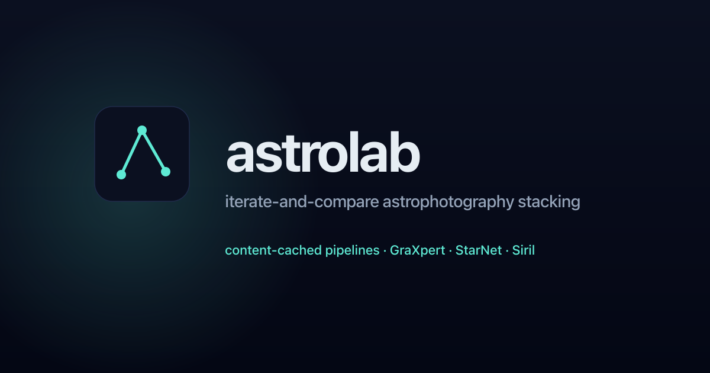

<p align="center">
  
</p>

<p align="center">
  <em>Iterate-and-compare astrophotography stacking. Tweak a slider, see the result, undo, branch, publish.</em>
</p>

---

## What it is

astrolab is a local-first workbench that wraps Siril, GraXpert, and StarNet++ behind a typed pipeline graph and a content-addressed cache. Each "project" is a live edit of a stack: changing a knob in the UI submits a fresh job, but every upstream node it didn't touch (calibrate, register, stack) is a free cache hit, so re-renders feel cheap. Every revision shows up in a history strip; promote keepers to a public gallery.

It is built around the Dwarf 3 capture layout for now, but nothing in the pipeline is Dwarf-specific. Want your scope supported? See the [Adding a scope](CONTRIBUTING.md#adding-a-scope) section in CONTRIBUTING.md; it starts with running a small collector script, not uploading raw files.

## What it does

- Wraps **Siril 1.4** for calibration, registration, stacking, and pixel ops.
- Drives **GraXpert** for background extraction and ML denoise.
- Drives **StarNet++ v2** for star removal, replacement, and recombination.
- Caches every node's output by `(inputs + params + node version)` so editing a downstream knob never re-runs an upstream node.
- Tracks a per-project edit history (revert, branch, compare, publish).
- Gallery view surfaces the renders you opt in to publish; everything else stays in your private history.

## Quick start

### Docker (recommended)

No local install needed. The image bundles Siril 1.4 and GraXpert 3.0.2.

**CPU-only (most users):**

```bash
docker run -d \
  -p 8000:8000 \
  -v ~/Pictures/Siril:/captures:ro \
  -v astrolab-data:/data \
  ghcr.io/bscholer/astrolab:latest
```

Open `http://localhost:8000`, go to **Settings**, set the captures path to `/captures`, hit **Refresh**, and your sessions appear.

**NVIDIA GPU (for GraXpert and StarNet++ AI nodes):**

You need the [NVIDIA Container Toolkit](https://docs.nvidia.com/datacenter/cloud-native/container-toolkit/install-guide.html) installed on the host first.

```bash
docker run -d \
  --gpus all \
  -p 8000:8000 \
  -v ~/Pictures/Siril:/captures:ro \
  -v astrolab-data:/data \
  -e ASTROLAB_ENABLE_STARNET=1 \
  ghcr.io/bscholer/astrolab:cuda
```

`ASTROLAB_ENABLE_STARNET=1` tells the entrypoint to download StarNet++ v2 on first run and store it in the persistent `/data` volume. Omit it if you don't need star removal.

**Mount points:**

| Path | Purpose |
|------|---------|
| `/captures` | Your raw capture tree (read-only is fine; astrolab never writes here) |
| `/data` | Persistent state: cache, projects, settings, optional StarNet++ binary |

---

### From source (dev / no Docker)

```bash
git clone https://github.com/bscholer/astrolab.git
cd astrolab

# python deps + venv (uv reads pyproject.toml)
uv sync

# UI deps
cd ui && npm install && cd ..

# run the API on :8000
.venv/bin/uvicorn server.api:app --reload --host 0.0.0.0 --port 8000

# in another terminal: vite dev server on :5173 (proxies /api to :8000)
cd ui && npm run dev
```

Open `http://localhost:5173`, point the captures path at your Siril folder in **Settings**, hit **Refresh**, and projects show up.

For a single-port setup mirroring production (`http://localhost:8000`), `cd ui && npm run build` once instead.

## Hardware + OS support

- **Linux + NVIDIA GPU** is the only supported runtime today. GraXpert and StarNet++ are CUDA-bound; Siril runs anywhere but the canned templates assume the AI nodes are available.
- **macOS** works for everything except the Siril-using paths. The test suite mocks the Siril subprocess, so the dev loop is full-featured; just do final validation on the Linux box.
- The auto-detection logic checks `~/Applications`, `~/Downloads`, `~/tools/{graxpert,starnet}/`, and `$PATH`, in that order.

## Status

Phase 0. Not stable, not packaged, schemas can change between commits. Useful enough to process my own captures every weekend; rough enough that I'd hate to ship it as v1.0.0 today. The [V1 milestone](https://github.com/bscholer/astrolab/milestone/1) tracks the punch list.

## Built on

The actual image processing is done by external tools that astrolab orchestrates:

- **[Siril](https://siril.org)** (GPLv3) - calibration, registration, stacking, plate-solving.
- **[GraXpert](https://www.graxpert.com)** (GPLv3) - background gradient extraction and ML denoise.
- **[StarNet++ v2](https://www.starnetastro.com)** (proprietary freeware) - star-nebula separation.

The `calibrate_register_stack` template follows the pipeline shape from [Naztronomy's smart-telescope script](https://github.com/naztronaut/siril-scripts/blob/main/Naztronomy-Smart_Telescope_PP.py). No code is copied; astrolab reimplements the same Siril command sequence as graph nodes so each step is cacheable. Stage order is his.

Full notes in [LICENSES/THIRD_PARTY.md](LICENSES/THIRD_PARTY.md).

## Links

- [Design doc](docs/design.md), the original README. Pipeline contracts, cache shape, node authoring guide.
- [Contributing](CONTRIBUTING.md). Dev setup, test/lint commands, "add a node" walkthrough.
- [Issue tracker](https://github.com/bscholer/astrolab/issues). [V1 board](https://github.com/users/bscholer/projects).

## License

MIT, with a CC BY-SA 4.0 carve-out for the vendored OpenNGC catalog under `catalogs/openngc/` (Mattia Verga). See [LICENSE](LICENSE) for both.

The Docker image bundles Siril (GPLv3) and GraXpert (GPLv3) as separate processes; astrolab's MIT license applies only to astrolab's own source code. See [LICENSES/THIRD_PARTY.md](LICENSES/THIRD_PARTY.md) for details.
